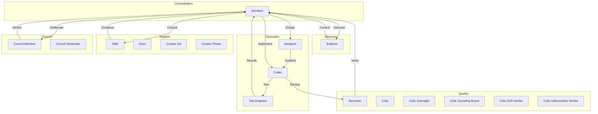

# OpenCode Swarm

<div align="center">

# Your AI writes the code. Swarm proves it works.

**Closing the trust gap between "the model said it's done" and "this actually works in production."**

[](https://www.npmjs.com/package/opencode-swarm)
[](LICENSE)
[](https://github.com/zaxbysauce/opencode-swarm)

[Website](https://swarmai.site/) · [Getting Started](docs/getting-started.md) · [Configuration](docs/configuration.md) · [Architecture](docs/architecture.md)

</div>

---

OpenCode Swarm is a plugin for [OpenCode](https://opencode.ai) that turns a single AI coding session into an **architect-led team of specialized core, optional, and conditional agents**. Run `/swarm agents` for the live roster; it is generated from the current plugin configuration. One agent writes the code. A different agent reviews it. Another writes and runs tests. Another checks security. **Nothing ships until every required gate passes.**

```bash
bunx opencode-swarm install
```

> This single command installs the package, registers it as an OpenCode plugin, disables conflicting default agents, and creates a ready-to-edit config at `~/.config/opencode/opencode-swarm.json`. Requires [Bun](https://bun.sh) (`bun --version` to check). If you must use npm: `npm install -g opencode-swarm && opencode-swarm install`.

> **First-run note:** the installer registers the plugin, writes the global plugin config, creates a project override when missing, and disables the native `explore` and `general` agents in `opencode.json`. If you are not using a Swarm architect, the Swarm gates, reviewers, and test agents are bypassed. Open the OpenCode agent or mode picker and choose the Swarm architect when needed.

### Why Swarm?

Most AI coding tools let one model write code and ask that same model whether the code is good. That misses too much. Swarm separates planning, implementation, review, testing, and documentation into specialized internal roles — and enforces gated execution so agents never mutate the codebase in parallel.

### Key Features

- 🏗️ **Specialized core, optional, and conditional agents** — architect, coder, reviewer, test_engineer, critic, explorer, sme, docs, designer, critic_oversight, critic_sounding_board, critic_drift_verifier, critic_hallucination_verifier, curator_init, curator_phase, council_generalist, council_skeptic, council_domain_expert. Run `/swarm agents` for the live roster — that is the source of truth, not this list.
- 🔒 **Gated pipeline** — code never ships without reviewer + test engineer approval
- 🔍 **DEEP_DIVE Protocol** — High-rigor, on-demand read-only codebase audit via specialized skills
- 🔬 **External Skill Curation Pipeline** — Opt-in discovery, quarantine, evaluation, and promotion of external skill candidates from configured sources (disabled by default; enable via `external_skills.curation_enabled: true` in config). Includes 7 tools: `external_skill_discover`, `external_skill_list`, `external_skill_inspect`, `external_skill_promote`, `external_skill_reject`, `external_skill_delete`, `external_skill_revoke`. Candidates pass through a 3-gate validation pipeline before evaluation: **prompt injection scan** (12 regex patterns), **unsafe instruction scan** (25 patterns), and **provenance integrity check** (SHA-256, timestamp, URL, publisher, and hash verification).
- 🔄 **Phase completion gates** — completion-verify and drift verifier gates enforced before phase completion
- 🔁 **Resumable sessions** — all state saved to `.swarm/`; pick up any project any day
- 🌐 **20 languages** — TypeScript, Python, Go, Rust, Java, Kotlin, C/C++, C#, Ruby, Swift, Dart, PHP, JavaScript, CSS, Bash, PowerShell, INI, Regex (extending: see [docs/adding-a-language.md](docs/adding-a-language.md))
- 🛡️ **Built-in security** — SAST, secrets scanning, dependency audit per task
- 🔒 **Scope enforcement** — Validates write targets against declared scope with cross-process persistence, TTL expiry, and scope-aware destructive command blocking. **Handles both single-string and array-based path arguments** (`files[]`, `paths[]`, `targetFiles[]`) to prevent scope bypass via multi-file tool calls.
- 📝 **Shell write detection** — Static analysis of POSIX/PowerShell/cmd commands to detect file writes (redirects, builtins, in-place editors, network downloads, archive extraction, git destructive ops) before execution
- 🆓 **Free tier** — works with OpenCode Zen's free model roster
- ⚙️ **Fully configurable** — override any agent's model, disable agents, tune guardrails

> **The Swarm architect coordinates all internal agents automatically.** You never manually switch between internal roles. If the active OpenCode agent is not a Swarm architect, the plugin workflow is bypassed.

---

## Shell Write Detection

Swarm includes comprehensive static analysis for shell commands to detect and intercept file write operations before execution.

### Shell Write Detection Features

- **POSIX shell detection** — Parses commands with `bash-parser` AST for accurate detection of:
  - Redirect operators (`>`, `>>`, `>|`, `<<`, `<<-`)
  - Here-documents and here-strings
  - Write-effect builtins (`cp`, `mv`, `install`, `ln`, `truncate`, `dd`)
  - In-place editors (`sed -i`, `perl -i`, `awk -i`)
  - Interpreter eval (`python -c`, `node -e`, `bun -e`, `ruby -e`, `php -r`)
  - Network downloaders (`curl -o`, `wget -O`, `scp`)
  - Archive extraction (`tar -x`, `unzip`, `gunzip`)
  - Git destructive operations (`git clean -fd`, `git reset --hard`)

- **Windows shell detection** — Uses regex heuristics for PowerShell and cmd.exe:
  - PowerShell cmdlets: `Out-File`, `Set-Content`, `Add-Content`, `Copy-Item`, `Move-Item`
  - cmd.exe builtins: `copy`, `move`, `ren`, `del`, `rd`, `md`
  - Redirect operators (`>`, `>>`)

- **Interactive session denial** — Blocks commands that create persistent or open-ended sessions:
  - POSIX: `watch`, `screen`, `tmux new-session`
  - PowerShell: `Start-Process`

- **Cross-process scope enforcement** — Declared scope is persisted to `.swarm/scopes/scope-{taskId}.json` with:
  - TTL expiry (default 24 hours)
  - Symlink guards (O_NOFOLLOW + realpath containment)
  - Schema versioning and fail-closed validation
  - **Scope-aware destructive command blocking** — Recursive delete patterns (`rm -rf`, `rmdir /s`, `del /s`, `Remove-Item -Recurse`, `rsync --delete`) are blocked unless ALL target paths are within the declared scope (coder agents only)

### Security Patterns

The guardrails system blocks destructive shell commands targeting:
- System paths (`/root`, `/etc`, `C:\Windows`, etc.)
- Symlink/junction creation with external targets
- File operations under `.swarm/` directory
- Fork bombs and infinite loops
- Disk wiping and ransomware-grade operations

---

## What Actually Happens

You say:

```text
Build me a JWT auth system.
```

Swarm then:

1. Clarifies only what it cannot infer.
2. Scans the codebase to understand what already exists.
3. Consults domain experts when needed and caches the guidance.
4. Writes a phased implementation plan.
5. Sends that plan through a critic gate before coding starts.
6. Executes one task at a time through the QA pipeline:

* coder writes code
* automated checks run
* reviewer checks correctness
* test engineer writes and runs tests
* architect runs regression sweep
* failures loop back with structured feedback

7. After each phase, docs and retrospectives are updated.

All project state lives in `.swarm/` — plans, evidence, context, knowledge, and telemetry. Resumable by design. If `.swarm/` already exists, the architect goes straight into **RESUME** → **EXECUTE** instead of repeating discovery.

---

## Execution Modes

Swarm has two independent mode systems:

**Session modes** — toggle per session with a slash command:

| Mode | Safety | Speed | When to Use |
|------|--------|-------|------------|
| **Balanced** (default) | High | Medium | Everyday development |
| **Turbo** | Medium | Fast | Rapid iteration; skips Stage B gates for non-Tier-3 files |
| **Lean Turbo** | High | Fast | Parallel lanes for non-conflicting tasks (up to `max_parallel_coders` coders) |
| **Full-Auto** | Deterministic policy + critic oversight | Fast | Unattended multi-interaction runs |

Full-Auto reduces approval friction by deterministically allowing safe operations (read-only tools, in-scope writes, safe shell) and routing every ambiguous or high-risk action (writes to plugin/build/guardrail paths, network, dependency changes, plan/phase mutations, subagent delegation) through the read-only `critic_oversight` agent before it executes. Denials are returned to the agent as structured signals so it can choose a safer path; repeated denials pause the run; phase completion requires an APPROVED oversight record. See [docs/modes.md](docs/modes.md#full-auto) for `mode`, `permission_policy`, `denials`, and `oversight` config keys, fail-closed semantics, and recovery from a paused run.

**Project mode** — persistent via `execution_mode` config key:

| Value | Effect |
|-------|--------|
| `strict` | Maximum safety — adds slop-detector and incremental-verify hooks |
| `balanced` (default) | Standard hooks |
| `fast` | Skips compaction service — for short sessions under context pressure |

Switch session modes with `/swarm turbo [on|off]` or `/swarm full-auto [on|off]`. Set project mode in config. Lean Turbo is configured in `turbo.lean.*` in config and composes with all session modes. See [docs/modes.md](docs/modes.md).

---

## Quick Start

**→ For a complete first-run walkthrough, see [Getting Started](docs/getting-started.md).**

The 15-minute guide covers:
- Installation (`bunx opencode-swarm install`)
- First-run auto-configuration (architect selected automatically)
- Running your first task
- Troubleshooting common issues

The installer automatically:
- Creates a project config at `.opencode/opencode-swarm.json` when missing so project-level overrides have a place to live
- Adds `opencode-swarm` to the OpenCode plugin list
- Disables the native `explore` and `general` agents to reduce routing conflicts

---

## 30-Second Demo

No animated GIF is shipped in the repo — instead, here is the exact terminal session you can record yourself with `asciinema rec demo.cast` (or any screen recorder). Every command below is real and runs against this repo as published.

**Recording script (copy/paste-able, ~30 seconds):**

```bash
# 1. Install the plugin (5s)
bunx opencode-swarm install

# 2. Open opencode and select a Swarm architect if it is not already active
opencode

# 3. Inside the OpenCode session, verify Swarm is live (5s)
/swarm help
/swarm agents

# 4. Kick off a task — the architect plans, then gates fire automatically (15s)
Build me a JWT auth helper with tests.

# 5. Watch the gates land in real time (5s)
/swarm status
/swarm evidence
```

**ASCII storyboard** of what a viewer should see:

```
┌──────────────────────────────────────────────────────────────┐
│ $ bunx opencode-swarm install                                │
│ ✓ installed opencode-swarm                                   │
│ ✓ created .opencode/opencode-swarm.json                     │
│                                                              │
│ $ opencode                                                   │
│ [Swarm] Welcome! Architect auto-selected. Type /swarm help  │
│                                                              │
│ > /swarm help                                                │
│ Available commands: status, plan, agents, help, diagnose... │
│                                                              │
│ > Build me a JWT auth helper with tests.                     │
│ [architect]  PLAN → critic gate → APPROVED                   │
│ [coder]      task 1.1 implementing…                          │
│ [reviewer]   correctness OK                                  │
│ [test_eng.]  3 tests written, 3 pass                         │
│ [architect]  regression sweep clean → phase_complete         │
│                                                              │
│ > /swarm evidence                                            │
│ task 1.1: review ✓  tests ✓  sast ✓  secrets ✓  drift ✓      │
└──────────────────────────────────────────────────────────────┘
```

Each row corresponds to a real gate documented further down this README — none are simulated.

---

## Upgrading

**OpenCode caches plugins indefinitely.** A normal OpenCode restart does **not**
pull newer versions from npm — once a plugin is cached, OpenCode keeps using
that exact copy on every subsequent launch (issue #675). The cache lives in
several places depending on your platform and OpenCode version:

- Current OpenCode cache layout:
  `~/.cache/opencode/node_modules/opencode-swarm/`
- Legacy Linux / devcontainers / GitHub Codespaces:
  `~/.config/opencode/node_modules/opencode-swarm/`
- Package cache layout:
  `~/.cache/opencode/packages/opencode-swarm@latest/`
- Platform-specific macOS / Windows cache roots:
  `~/Library/Caches/opencode/...`, `%LOCALAPPDATA%\opencode\...`, or `%APPDATA%\opencode\...`

The updater also clears known OpenCode lock files (`bun.lock`, `bun.lockb`, and `package-lock.json`) so the next start resolves the latest package.

To upgrade to the latest published version (clears both layouts automatically):

```bash
bunx opencode-swarm update     # cache-only refresh, then restart opencode
# or
bunx opencode-swarm install    # full reinstall (re-asserts config), then restart opencode
```

`/swarm diagnose` shows the running version and, when available, the latest
version on npm so you can tell at a glance whether your cache is stale.

To disable the background staleness check entirely, set `version_check: false`
in your `opencode-swarm.json`.

---

## Commands

Common subcommands at a glance:

```bash
/swarm help [command]      # List all commands or get detailed help for a specific command
/swarm status              # Current phase and task
/swarm show-plan [N]       # Full plan or filtered by phase
/swarm agents              # Registered agents and models
/swarm diagnose            # Health check
/swarm evidence [task]     # Test and review results
/swarm reset --confirm     # Clear swarm state
```

Use `/swarm help` to see all available commands categorized by function. Use `/swarm help <command>` for detailed usage information on a specific command.

Nine commands display a ⚠️ warning in help output because they share names with Claude Code built-in slash commands (e.g., `/plan`, `/reset`, `/status`). The warning reminds you to always use `/swarm <command>` — the bare CC command does something different and sometimes destructive. See [docs/commands.md#claude-code-command-conflicts](docs/commands.md#claude-code-command-conflicts) for the full conflict registry.

See [docs/commands.md](docs/commands.md) for the full reference. The live source of truth is `src/commands/registry.ts`, which includes canonical commands, compound commands, and deprecated aliases.

## Command Aliases

Some commands are available under deprecated names for backwards compatibility. Using the canonical name is recommended:

| Alias (deprecated) | Canonical command |
|--------------------|-------------------|
| `/swarm config-doctor` | `/swarm config doctor` |
| `/swarm diagnosis` | `/swarm diagnose` |
| `/swarm evidence-summary` | `/swarm evidence summary` |
| `/swarm doctor` | `/swarm config doctor` |
| `/swarm info` | `/swarm status` |
| `/swarm list-agents` | `/swarm agents` |
| `/swarm health` | `/swarm diagnose` |
| `/swarm plan` | `/swarm show-plan` |
| `/swarm close` | `/swarm finalize` |
| `/swarm check` | `/swarm preflight` |
| `/swarm clear` | `/swarm reset-session` |

Aliases are hidden from help output but still function. The canonical command should be used in scripts and documentation.

---

## The Agents

Swarm registers a roster of specialized core, optional, and conditional agents. The exact count shifts as agents are added or feature-flagged, so treat `/swarm agents` as the live source of truth — that command lists what is actually registered in your session. You don't manually switch between them — the architect coordinates automatically.

| Agent | Role | Badge |
|---|---|---|
| **architect** | Orchestrates workflow, writes plans, enforces gates | Core |
| **explorer** | Scans codebase, gathers context, maps facts | Core |
| **coder** | Implements one task at a time | Core |
| **reviewer** | Checks correctness and security | Core |
| **test_engineer** | Writes and runs tests, adversarial testing | Core |
| **critic** | Reviews plans before implementation begins | Core |
| **critic_oversight** | Sole quality gate in full-auto autonomous mode | Core |
| **sme** | Provides domain expertise guidance | Core |
| **docs** | Updates documentation to match implementation | Core |
| **designer** | Generates UI scaffolds and design tokens | Conditional |
| **critic_sounding_board** | Pre-escalation pushback to the architect | Optional |
| **critic_drift_verifier** | Verifies implementation matches spec | Optional |
| **critic_hallucination_verifier** | Verifies APIs and citations against real sources | Optional |
| **curator_init** | Consolidates prior knowledge at session start | Optional |
| **curator_phase** | Consolidates phase outcomes, detects workflow drift | Optional |
| **council_generalist** | Broad analytical voice in the General Council (uses reviewer model) | Conditional |
| **council_skeptic** | Adversarial stress-tester voice in the General Council (uses critic model) | Conditional |
| **council_domain_expert** | Technical-depth voice in the General Council (uses SME model) | Conditional |

Legend: Core = always available, Optional = available by default (can be disabled), Conditional = requires specific feature config (ui_review or council)

Run `/swarm status` and `/swarm agents` to see what's active.



---

## How It Compares

| Feature | Swarm | oh-my-opencode | get-shit-done |
|---|:-:|:-:|:-:|
| Multiple specialized agents | ✅ Core + optional + conditional roster (`/swarm agents`) | ❌ | ❌ |
| Plan reviewed before coding | ✅ | ❌ | ❌ |
| Every task reviewed + tested | ✅ | ❌ | ❌ |
| Different model for review vs. code | ✅ | ❌ | ❌ |
| Shell write detection (POSIX/PowerShell/cmd) | ✅ | ❌ | ❌ |
| Scope enforcement with cross-process persistence | ✅ | ❌ | ❌ |
| Interactive session detection and blocking | ✅ | ❌ | ❌ |
| Resumable sessions | ✅ | ❌ | ❌ |
| Built-in security scanning | ✅ | ❌ | ❌ |
| Learns from mistakes | ✅ | ❌ | ❌ |

---

## LLM Provider Guide

Swarm works with any provider supported by OpenCode.

### Free Tier (OpenCode Zen)

No API key required. Excellent starting point:

```json
{
  "agents": {
    "coder": { "model": "opencode/minimax-m2.5-free" },
    "reviewer": { "model": "opencode/big-pickle" },
    "explorer": { "model": "opencode/big-pickle" }
  }
}
```

### Paid Providers

For production, mix providers by role:

| Agent | Recommended | Why |
|---|---|---|
| architect | OpenCode UI selection | Needs strongest reasoning |
| coder | minimax-coding-plan/MiniMax-M2.5 | Fast, accurate code generation |
| reviewer | zai-coding-plan/glm-5 | Different training from coder |
| test_engineer | minimax-coding-plan/MiniMax-M2.5 | Same strengths as coder |
| explorer | google/gemini-2.5-flash | Fast read-heavy analysis |
| sme | kimi-for-coding/k2p5 | Strong domain expertise |

### Provider Formats

| Provider | Format | Example |
|---|---|---|
| OpenCode Zen | `opencode/<model>` | `opencode/big-pickle` |
| Anthropic | `anthropic/<model>` | `anthropic/claude-sonnet-4-20250514` |
| Google | `google/<model>` | `google/gemini-2.5-flash` |
| Z.ai | `zai-coding-plan/<model>` | `zai-coding-plan/glm-5` |
| MiniMax | `minimax-coding-plan/<model>` | `minimax-coding-plan/MiniMax-M2.5` |
| Kimi | `kimi-for-coding/<model>` | `kimi-for-coding/k2p5` |

### Model Fallback

Automatic fallback to a secondary model on transient errors:

```json
{
  "agents": {
    "coder": {
      "model": "anthropic/claude-sonnet-4-20250514",
      "fallback_models": ["opencode/gpt-5-nano"]
    }
  }
}
```

See [docs/configuration.md](docs/configuration.md) for full configuration reference.

---

<details>
<summary><strong>Advanced Topics (Technical Detail)</strong></summary>

### Process Remediation Model (PRM)

Swarm monitors agent trajectories and injects course-correction guidance before loops form. Detects five failure patterns:

1. **Repetition Loop** — Same agent performs the same action repeatedly
2. **Ping-Pong** — Agents hand off back and forth without progress
3. **Expansion Drift** — Plan scope grows beyond original task
4. **Stuck-on-Test** — Coder and tests fail in a loop
5. **Context Thrashing** — Agent requests increasingly large file sets

When detected, escalation levels trigger:
- Level 1: Advisory guidance injected
- Level 2: Architect alert sent
- Level 3: Hard stop directive

Configure via:

```json
{
  "prm": {
    "enabled": true,
    "pattern_thresholds": {
      "repetition_loop": 2,
      "ping_pong": 4,
      "expansion_drift": 3,
      "stuck_on_test": 3,
      "context_thrash": 5
    }
  }
}
```

> **Note:** Some configuration fields (`max_trajectory_lines`, `escalation_enabled`) are defined in schema but not yet enforced at runtime.

### Persistent Memory

**`.swarm/plan-ledger.jsonl`** — authoritative source of truth (v6.44 durability model)

**`.swarm/context.md`** — technical decisions and cached SME guidance

**`.swarm/evidence/`** — review/test results per task

**`.swarm/telemetry.jsonl`** — session observability events (fire-and-forget, never blocks execution)

**`.swarm/curator-summary.json`** — phase-level intelligence and drift reports

### Guardrails & Circuit Breakers

Every agent runs inside a circuit breaker that prevents runaway behavior:

| Signal | Default Limit |
|--------|:---:|
| Tool calls | 200 |
| Duration | 30 min |
| Same tool repeated | 10x |
| Consecutive errors | 5 |

Limits reset per task. Per-agent overrides available in config.

### File Authority (Per-Agent Write Permissions)

Each agent can only write to specific paths:

- **architect** — Everything (except `.swarm/plan.md`, `.swarm/plan.json`)
- **coder** — `src/`, `tests/`, `docs/`, `scripts/`
- **reviewer** — `.swarm/evidence/`
- **test_engineer** — `tests/`, `.swarm/evidence/`
- **explorer, sme** — Read-only

Override via `authority.rules` in config.

### Quality Gates

Built-in tools verify every task before it ships:

- **syntax_check** — Tree-sitter validation across the configured language grammar map
- **placeholder_scan** — Catches TODOs, stubs, incomplete code
- **sast_scan** — 63+ security rules, 9 languages (offline)
- **sbom_generate** — Dependency tracking (CycloneDX)
- **quality_budget** — Complexity, duplication, test ratio limits

These quality gates run locally. No Docker is required. Config-gated features such as General Council web search can make external API calls only when you enable them and provide a Tavily or Brave Search key.

### Context Budget Guard

The Context Budget Guard monitors how much context Swarm is injecting into the conversation. It helps prevent context overflow before it becomes a problem.

### Default Behavior

- **Enabled automatically** — No setup required. Swarm starts tracking context usage right away.
- **What it measures** — Only the context that Swarm injects (plan, context, evidence, retrospectives). It does **not** count your chat history or the model's responses.
- **Warning threshold (0.7 ratio)** — When swarm-injected context reaches ~2800 tokens (70% of 4000), the architect receives a one-time advisory warning. This is informational — execution continues normally.
- **Critical threshold (0.9 ratio)** — When context reaches ~3600 tokens (90% of 4000), the architect receives a critical alert with a recommendation to run `/swarm handoff`. This is also one-time only.
- **Non-nagging** — Alerts fire once per session, not repeatedly. You won't be pestered every turn.
- **Who sees warnings** — Only the architect receives these warnings. Other agents are unaware of the budget.

To disable entirely, set `context_budget.enabled: false` in your swarm config.

---

### Skill Propagation

Swarm includes an intelligent skill propagation system that tracks, validates, and scores skill usage across agent delegations. When the architect delegates to subagents (coder, reviewer, test_engineer, etc.), the system:

- **Logs skill usage** to `.swarm/skill-usage.jsonl` with session-scoped entries (agent, task ID, skill paths, timestamp)
- **Scores skill relevance** based on frequency, compliance, recency, task ID diversity, and context matching
- **Provides recommendations** — when delegating without a `SKILLS:` field, the system suggests relevant skills with relevance scores
- **Enforces compliance** — optional enforcement mode can block delegations missing the `SKILLS:` field
- **Auto-populates skill index** — maintains a `## Available Skills` section in `.swarm/context.md` with usage counts and compliance rates
- **Supports explicit routing** — `.opencode/skill-routing.yaml` maps agent types to specific skill paths with optional keyword descriptions

**Guardrails:**
- Relevance scoring threshold: 0.5 (skills below this are not recommended)
- Maximum recommendations per delegation: 5
- Scoring budget safeguard: Skipped when session exceeds 500 skill-usage entries to prevent unbounded file reads
- Graceful degradation: Zero installed skills = zero friction — no warnings, no blocks, no auto-population

**Configuration:**

```json
{
  "skill_propagation": {
    "enabled": true,
    "enforce": false,
    "scoring": {
      "threshold": 0.5,
      "max_recommendations": 5
    }
  }
}
```

**Skill routing file format** (`.opencode/skill-routing.yaml`):

```yaml
version: 1
routing:
  coder:
    - path: .claude/skills/writing-tests/SKILL.md
      keywords: ["test", "testing", "writing tests"]
    - path: .claude/skills/engineering-conventions/SKILL.md
      keywords: ["engineering", "conventions", "invariants"]
  reviewer:
    - path: .claude/skills/swarm-pr-review/SKILL.md
      keywords: ["review", "security", "audit"]
```

Routing skills are merged with scored recommendations, with explicitly routed skills receiving a boosted score (0.9) to prioritize them.

### Skill Lifecycle Management

Swarm provides tools for managing generated skill lifecycles:

- **`skill_retire`** — Retires an active generated skill by creating a `retired.marker` file in its directory. Retired skills are excluded from discovery, scoring, and injection. The SKILL.md file is preserved for auditability. Use `skill_retire(slug, reason?)` to retire a skill, or pass a reason for tracking purposes.

- **`skill_regenerate`** — Re-clusters the source knowledge entries for an active skill and updates the SKILL.md in place. Reads the existing SKILL.md frontmatter to identify source knowledge IDs, resolves current entries from knowledge stores, and re-renders the skill content. Falls back to fuzzy slug-based re-clustering if source IDs yield no matches. Skills whose source knowledge is entirely archived are automatically retired during regeneration.

- **Auto-retire health check** — During each curator phase run, skills are automatically evaluated for retirement when:
  - The skill's violation rate exceeds 30% (based on skill-usage.jsonl compliance verdicts)
  - All of the skill's source knowledge entries have been archived

  Auto-retired skills are noted in the phase digest summary. The check is non-blocking — errors are caught and logged without failing the curator.

- **Proposal cleanup** — When a draft skill proposal is activated via `skill_apply`, the source proposal file is deleted as part of the activation process (best-effort; permission errors are logged but do not block activation).

### External Skill Curation

Swarm provides an opt-in, quarantine-first pipeline for discovering, validating, and promoting external skills. Disabled by default — no network calls are made until explicitly enabled.

#### Enabling

```yaml
external_skills:
  curation_enabled: true
  sources:
    - type: url
      location: https://example.com/skills/
      trust_level: medium
```

#### Validation Pipeline

Every candidate passes a 3-gate pipeline before entering quarantine:

| Gate | Name | Description |
|------|------|-------------|
| 1 | Prompt Injection Scan | 12 regex patterns plus oversized field, invisible character, and suspicious formatting checks detect system instruction injection, role hijacking, and instruction override attempts |
| 2 | Unsafe Instruction Scan | 25 patterns detect shell commands, file system attacks, network exfiltration, and privilege escalation |
| 3 | Provenance Integrity | SHA-256 content hash, timestamp validation, URL format checks, and publisher presence validation |

**Trust level modulation**: `low` trust promotes warning-severity findings to errors (stricter); `medium` and `high` trust levels keep warnings advisory. Error-severity findings always block regardless of trust level.

#### Tool Reference

| Tool | Description |
|------|-------------|
| `external_skill_discover` | Fetch and validate a skill from a configured source |
| `external_skill_list` | List candidates with status filters |
| `external_skill_inspect` | View full candidate details |
| `external_skill_promote` | Promote validated candidate to active skill (user approval required) |
| `external_skill_reject` | Reject candidate with reason |
| `external_skill_delete` | Remove candidate from quarantine store |
| `external_skill_revoke` | Retire a previously promoted skill |

#### Security Guarantees

- Disabled by default — no network calls until explicitly enabled
- All candidates quarantined until human review and promotion
- TOCTOU re-validation at promotion time
- Content hash verification prevents tampering
- Bounded concurrent fetches (5 simultaneous) and discovery limits (50 candidates per invocation)
- Max candidate size and count bounds
- Source origin validation (URLs must match configured sources)

#### Limitations

- Static regex patterns only (no LLM-based detection)
- No cryptographic signing (deferred)
- No batch import (deferred)
- No auto-promotion (human approval always required)

### Configuration Reference

| Key | Type | Default | Description |
|-----|------|---------|-------------|
| `context_budget.enabled` | boolean | `true` | Enable or disable the context budget guard entirely |
| `context_budget.max_injection_tokens` | number | `4000` | Token budget for swarm-injected context per turn. This is NOT the model's context window — it's the swarm plugin's own contribution |
| `context_budget.warn_threshold` | number | `0.7` | Ratio (0.0-1.0) of `max_injection_tokens` that triggers a warning advisory |
| `context_budget.critical_threshold` | number | `0.9` | Ratio (0.0-1.0) of `max_injection_tokens` that triggers a critical alert with handoff recommendation |
| `context_budget.enforce` | boolean | `true` | When true, enforces budget limits and may trigger handoffs |
| `context_budget.prune_target` | number | `0.7` | Ratio (0.0-1.0) of context to preserve when pruning occurs |
| `context_budget.preserve_last_n_turns` | number | `4` | Number of recent turns to preserve when pruning |
| `context_budget.recent_window` | number | `10` | Number of turns to consider as "recent" for scoring |
| `context_budget.tracked_agents` | string[] | `['architect']` | Agents to track for context budget warnings |
| `context_budget.enforce_on_agent_switch` | boolean | `true` | Enforce budget limits when switching agents |
| `context_budget.model_limits` | record | `{ default: 128000 }` | Per-model token limits (model name -> max tokens) |
| `context_budget.tool_output_mask_threshold` | number | `2000` | Threshold for masking tool outputs (chars) |
| `context_budget.scoring.enabled` | boolean | `false` | Enable context scoring/ranking |
| `context_budget.scoring.max_candidates` | number | `100` | Maximum items to score (10-500) |
| `context_budget.scoring.weights` | object | `{ recency: 0.3, ... }` | Scoring weights for priority |
| `context_budget.scoring.decision_decay` | object | `{ mode: 'exponential', half_life_hours: 24 }` | Decision relevance decay |
| `context_budget.scoring.token_ratios` | object | `{ prose: 0.25, code: 0.4, ... }` | Token cost multipliers |

### Example Configurations

**Minimal (disable):**
```json
{
  "context_budget": {
    "enabled": false
  }
}
```

**Default (reference):**
```json
{
  "context_budget": {
    "enabled": true,
    "max_injection_tokens": 4000,
    "warn_threshold": 0.7,
    "critical_threshold": 0.9,
    "enforce": true,
    "prune_target": 0.7,
    "preserve_last_n_turns": 4,
    "recent_window": 10,
    "tracked_agents": ["architect"],
    "enforce_on_agent_switch": true,
    "model_limits": { "default": 128000 },
    "tool_output_mask_threshold": 2000,
    "scoring": {
      "enabled": false,
      "max_candidates": 100,
      "weights": { "recency": 0.3, "relevance": 0.4, "importance": 0.3 },
      "decision_decay": { "mode": "exponential", "half_life_hours": 24 },
      "token_ratios": { "prose": 0.25, "code": 0.4, "json": 0.6, "logs": 0.1 }
    }
  }
}
```

**Aggressive (for long-running sessions):**
```json
{
  "context_budget": {
    "enabled": true,
    "max_injection_tokens": 2000,
    "warn_threshold": 0.5,
    "critical_threshold": 0.75,
    "enforce": true,
    "prune_target": 0.6,
    "preserve_last_n_turns": 2,
    "recent_window": 5,
    "tracked_agents": ["architect"],
    "enforce_on_agent_switch": true,
    "model_limits": { "default": 128000 },
    "tool_output_mask_threshold": 1500,
    "scoring": {
      "enabled": true,
      "max_candidates": 50,
      "weights": { "recency": 0.5, "relevance": 0.3, "importance": 0.2 },
      "decision_decay": { "mode": "linear", "half_life_hours": 12 },
      "token_ratios": { "prose": 0.2, "code": 0.35, "json": 0.5, "logs": 0.05 }
    }
  }
}
```

### What This Does NOT Do

- **Does NOT prune chat history** — Your conversation with the model is untouched
- **Does NOT modify tool outputs** — What tools return is unchanged
- **Does NOT block execution** — The guard is advisory only; it warns but never stops the pipeline
- **Does NOT interact with compaction.auto** — Separate feature with separate configuration
- **Only measures swarm's injected context** — Not the full context window, just what Swarm adds

</details>

<details>
<summary><strong>Quality Gates (Technical Detail)</strong></summary>

### Built-in Tools and Hooks

| Surface | What It Does |
|------|-------------|
| syntax_check | Tree-sitter validation across the configured language grammar map |
| placeholder_scan | Catches TODOs, FIXMEs, stubs, placeholder text |
| sast_scan | Offline security analysis, 63+ rules, 9 languages |
| sbom_generate | CycloneDX dependency tracking, 8 ecosystems |
| build_check | Runs your project's native build/typecheck |
| incremental_verify | Post-coder hook for TS/JS, Go, Rust, Python, and C#; configured by `incremental_verify.*`, not invoked as a registered tool |
| quality_budget | Enforces complexity, duplication, and test ratio limits |
| pre_check_batch | Runs lint, secretscan, SAST, and quality budget in parallel (~15s vs ~60s sequential) |
| phase_complete | Enforces phase completion, verifies required agents, requires a valid retrospective evidence bundle, logs events, and resets state; appends to `events.jsonl` with file locking |
| mutation_test | Applies LLM-generated mutation patches to source files and runs tests to measure kill rate; verdict is pass/warn/fail based on configurable thresholds; used by the mutation_test gate (opt-in, off by default) |
| generate_mutants | Architect-only: generates LLM-based mutation patches (5–10 per function across 6 types: off-by-one, null substitution, operator swap, guard removal, branch swap, side-effect deletion) for direct consumption by the mutation_test tool; returns SKIP verdict on LLM failure rather than throwing |
| write_mutation_evidence | Architect-only: writes mutation gate results atomically to `.swarm/evidence/{phase}/mutation-gate.json`; accepts verdict (PASS/WARN/FAIL/SKIP), kill rate metrics, and optional survived mutant details; normalizes uppercase-to-lowercase before persisting |
| git_blame | Per-line git blame metadata (sha, author, date, summary) via `git blame --porcelain`; supports optional line range filtering |
| diff | Structured git diff with contract change detection; supports `summaryOnly` mode returning file list with additions/deletions counts |
| suggest_patch | Reviewer-safe structured patch suggestion; supports `format` parameter ('json' or 'unified') where unified outputs valid unified diff with `diff --git` headers, hunks, and context |
| test_runner | Auto-detect and run tests; supports `bail` parameter to inject framework-specific bail flags for early exit on first failure |
| symbols | Extract exported symbols from source files; supports `workspace` (boolean) and `name` (string) parameters for multi-file symbol search |


Quality-gate surfaces run locally and require no Docker. Optional search-backed council features use external APIs only when explicitly enabled and configured.

Optional enhancement: Semgrep (if on PATH).

### Gate Configuration

```json
{
  "gates": {
    "syntax_check": { "enabled": true },
    "placeholder_scan": { "enabled": true },
    "sast_scan": { "enabled": true },
    "quality_budget": {
      "enabled": true,
      "max_complexity_delta": 5,
      "min_test_to_code_ratio": 0.3
    }
  }
}
```

</details>

<details>
<summary><strong>File Locking for Concurrent Write Safety</strong></summary>

Swarm uses file locking to protect shared state files from concurrent write corruption. The locking strategy differs by file: `plan.json` uses hard locking (write blocked on contention), while `events.jsonl` uses advisory locking (write proceeds with a warning on contention).

### Locking Implementation

- **Library**: `proper-lockfile` with `retries: 0` (fail-fast — no polling retries)
- **Scope**: Each tool acquires an exclusive lock on the target file before writing
- **Agents**: Lock is tagged with the current agent name and task context for diagnostics

### Protected Files

| File | Tool | Lock Key |
|------|------|----------|
| `.swarm/plan.json` | `update_task_status` | `plan.json` |
| `.swarm/events.jsonl` | `phase_complete` | `events.jsonl` |

### Lock Semantics

The two protected tools use different strategies:

**`update_task_status` — Hard lock on `plan.json`**

When two calls contend for `plan.json`:
1. **Exactly one call wins** — only the first to acquire the lock proceeds
2. **Winner writes** — the lock holder writes to the file, then releases the lock
3. **Losers receive `success: false`** — with `recovery_guidance: "retry"` and an error message identifying the lock holder

```json
{
  "success": false,
  "message": "Task status write blocked: plan.json is locked by architect (task: update-task-status-1.1-1234567890)",
  "errors": ["Concurrent plan write detected — retry after the current write completes"],
  "recovery_guidance": "Wait a moment and retry update_task_status. The lock will expire automatically if the holding agent fails."
}
```

**What the caller should do**: Retry `update_task_status` after a short delay.

**`phase_complete` — Advisory lock on `events.jsonl`**

When two calls contend for `events.jsonl`:
1. **Lock is attempted** — if acquired, write is serialized
2. **If lock unavailable** — a warning is added to the result and the write proceeds anyway
3. **Both callers return `success: true`** — duplicate concurrent appends are possible but `events.jsonl` is an append-only log and duplicate phase entries do not corrupt state

This asymmetry is intentional: `plan.json` stores mutable structured JSON where concurrent overwrites produce malformed files; `events.jsonl` is an append-only log where a duplicate entry is a recoverable nuisance.

### Lock Recovery

If a lock-holding agent crashes or hangs, the lock file will eventually expire (handled by `proper-lockfile` stale-lock cleanup). On the next retry, the call will succeed. Swarm does not auto-retry on lock contention — the architect receives the error and decides when to retry.

</details>

<details>
<summary id="configuration-reference"><strong>Full Configuration Reference</strong></summary>

Config file location: `~/.config/opencode/opencode-swarm.json` (global) or `.opencode/opencode-swarm.json` (project). Project config merges over global.

```json
{
  "agents": {
    "architect": { "model": "anthropic/claude-opus-4-6" },
    "coder": { "model": "minimax-coding-plan/MiniMax-M2.5", "fallback_models": ["minimax-coding-plan/MiniMax-M2.1"] },
    "explorer": { "model": "minimax-coding-plan/MiniMax-M2.1" },
    "sme": { "model": "kimi-for-coding/k2p5" },
    "critic": { "model": "zai-coding-plan/glm-5" },
    "reviewer": { "model": "zai-coding-plan/glm-5", "fallback_models": ["opencode/big-pickle"] },
    "test_engineer": { "model": "minimax-coding-plan/MiniMax-M2.5" },
    "docs": { "model": "zai-coding-plan/glm-4.7-flash" },
    "designer": { "model": "kimi-for-coding/k2p5" }
  },
  "guardrails": {
    "max_tool_calls": 200,
    "max_duration_minutes": 30,
    "profiles": {
      "coder": { "max_tool_calls": 500 }
    }
  },
  "authority": {
    "enabled": true,
    "rules": {
      "coder": {
        "allowedPrefix": ["src/", "lib/"],
        "blockedPrefix": [".swarm/"],
        "blockedZones": ["generated"]
      }
    }
  },
  "review_passes": {
    "always_security_review": false,
    "security_globs": ["**/*auth*", "**/*crypto*", "**/*session*"]
  },
  "automation": {
    "mode": "manual",
    "capabilities": {
      "plan_sync": true,
      "phase_preflight": false,
      "config_doctor_on_startup": false,
      "config_doctor_autofix": false,
      "evidence_auto_summaries": true,
      "decision_drift_detection": true
    }
  },
  "knowledge": {
    "enabled": true,
    "swarm_max_entries": 100,
    "hive_max_entries": 200,
    "auto_promote_days": 90,
    "max_inject_count": 5,
    "inject_char_budget": 2000,
    "max_lesson_display_chars": 120,
    "dedup_threshold": 0.6,
    "scope_filter": ["global"],
    "hive_enabled": true,
    "rejected_max_entries": 20,
    "validation_enabled": true,
    "evergreen_confidence": 0.9,
    "evergreen_utility": 0.8,
    "low_utility_threshold": 0.3,
    "min_retrievals_for_utility": 3,
    "schema_version": 1
  }
}
```

### Automation

## Mode Detection (v6.13)

Swarm now explicitly distinguishes five architect modes:

- **`DISCOVER`** — After the explorer finishes scanning the codebase.
- **`PLAN`** — When the architect writes or updates the plan.
- **`EXECUTE`** — During task implementation (the normal pipeline).
- **`PHASE-WRAP`** — After all tasks in a phase are completed, before docs are updated.
- **`UNKNOWN`** — Fallback when the current state does not match any known mode.

Each mode determines which injection blocks are added to the LLM prompt (e.g., plan cursor is injected in `PLAN`, tool output truncation in `EXECUTE`, etc.).

Default mode: `manual`. No background automation — all actions require explicit slash commands.

Modes:

- `manual` — No background automation. All actions via slash commands (default).
- `hybrid` — Background automation for safe operations, manual for sensitive ones.
- `auto` — Full background automation.

Capability defaults:

- `plan_sync`: `true` — Background plan synchronization using `fs.watch` with debounced writes (300ms) and 2-second polling fallback
- `phase_preflight`: `false` — Phase preflight checks before agent execution (opt-in)
- `config_doctor_on_startup`: `false` — Validate configuration on startup
- `config_doctor_autofix`: `false` — Auto-fix for config doctor (opt-in, security-sensitive)
- `evidence_auto_summaries`: `true` — Automatic summaries for evidence bundles
- `decision_drift_detection`: `true` — Detect drift between planned and actual decisions

## Plan Cursor (v6.13)

The `plan_cursor` config compresses the plan that is injected into the LLM context.

```json
{
  "plan_cursor": {
    "enabled": true,
    "max_tokens": 1500,
    "lookahead_tasks": 2
  }
}
```

- **enabled** – When `true` (default) Swarm injects a compact plan cursor instead of the full `plan.md`.
- **max_tokens** – Upper bound on the number of tokens emitted for the cursor (default 1500). The cursor contains the current phase summary, the full current task, and up to `lookahead_tasks` upcoming tasks. Earlier phases are reduced to one‑line summaries.
- **lookahead_tasks** – Number of future tasks to include in full detail (default 2). Set to `0` to show only the current task.

Disabling (`"enabled": false`) falls back to the pre‑v6.13 behavior of injecting the entire plan text.

## Tool Output Truncation (v6.13)

Control the size of tool outputs that are sent back to the LLM.

```json
{
  "tool_output": {
    "truncation_enabled": true,
    "max_lines": 150,
    "per_tool": {
      "diff": 200,
      "symbols": 100
    }
  }
}
```

- **truncation_enabled** – Global switch (default true).
- **max_lines** – Default line limit for any tool output.
- **per_tool** – Overrides `max_lines` for specific tools. The `diff` and `symbols` tools are truncated by default because their outputs can be very large.

When truncation is active, a footer is appended:

```
---
[output truncated to {maxLines} lines – use `tool_output.per_tool.<tool>` to adjust]
```

## Summarization Settings

Control how tool outputs are summarized for LLM context.

```json
{
  "summaries": {
    "threshold_bytes": 102400,
    "exempt_tools": ["retrieve_summary", "task", "read"]
  }
}
```

- **threshold_bytes** – Output size threshold in bytes before summarization is triggered (default 102400 = 100KB).
- **exempt_tools** – Tools whose outputs are never summarized. Defaults to `["retrieve_summary", "task", "read"]` to prevent re-summarization loops.

> **Note:** The `retrieve_summary` tool supports paginated retrieval via `offset` and `limit` parameters to fetch large summarized outputs in chunks.

---

### Disabling Agents

```json
{
  "sme": { "disabled": true },
  "designer": { "disabled": true },
  "test_engineer": { "disabled": true }
}
```

</details>

<details>
<summary><strong>All Slash Commands</strong></summary>

| Command | Description |
|---------|-------------|
| `/swarm help [command]` | List all commands or get detailed help for a specific command |
| `/swarm status` | Current phase, task progress, agent count |
| `/swarm show-plan [N]` | Full plan or filtered by phase |
| `/swarm plan [N]` | Deprecated alias for `/swarm show-plan [N]` |
| `/swarm agents` | Registered agents with models and permissions |
| `/swarm history` | Completed phases with status |
| `/swarm config` | Current resolved configuration |
| `/swarm diagnose` | Health check for `.swarm/` files and config |
| `/swarm export` | Export plan and context as portable JSON |
| `/swarm evidence [task]` | Evidence bundles for a task or all tasks |
| `/swarm archive [--dry-run]` | Archive old evidence with retention policy |
| `/swarm benchmark` | Performance benchmarks |
| `/swarm retrieve [id]` | Retrieve auto-summarized tool outputs (supports offset/limit pagination) |
| `/swarm reset --confirm` | Clear swarm state files |
| `/swarm reset-session` | Clear session state files in `.swarm/session/` (preserves plan and context) |
| `/swarm preflight` | Run phase preflight checks |
| `/swarm config doctor [--fix]` | Config validation with optional auto-fix |
| `/swarm doctor tools` | Tool registration coherence and binary readiness check |
| `/swarm sync-plan` | Force `plan.md` regeneration from the canonical plan ledger |
| `/swarm specify [description]` | Generate or import a feature specification |
| `/swarm clarify [topic]` | Clarify and refine an existing feature specification |
| `/swarm analyze` | Analyze spec.md vs plan.md for requirement coverage gaps |
| `/swarm sdd ...` | Inspect, validate, or project OpenSpec-compatible SDD artifacts into `.swarm/spec.md` |
| `/swarm brainstorm [topic]` | Enter BRAINSTORM mode for structured requirement discovery before a spec |
| `/swarm council <question> [--preset <name>] [--spec-review]` | Convene a multi-model General Council for advisory deliberation |
| `/swarm issue <issue-url\|owner/repo#N\|N> [--plan] [--trace]` | Ingest a GitHub issue for localization and resolution |
| `/swarm pr-review <pr-url\|owner/repo#N\|N> [--council] [instructions...]` | Structured deep PR review with parallel lanes, reviewer confirmation, and critic challenge |
| `/swarm pr-feedback [<pr-url\|owner/repo#N\|N>] [instructions...]` | Ingest and close known PR feedback (review comments, CI failures, conflicts) without a fresh review |
| `/swarm deep-dive <scope> [--profile <name>] [--max-explorers <n>]` | Read-only codebase audit with parallel explorers, dual reviewers, and critic challenge |
| `/swarm design-docs <description> [--out <dir>] [--lang <name>] [--update]` | Generate or sync language-agnostic design docs (requires `design_docs.enabled`) |
| `/swarm dark-matter` | Detect hidden file couplings from co-change history |
| `/swarm finalize [--prune-branches] [--skill-review]` | Idempotent session close-out: retrospectives, lesson curation, evidence archive, context.md reset, config-backup cleanup, optional branch pruning, optional skill-improver proposal |
| `/swarm close [--prune-branches] [--skill-review]` | Deprecated alias for `/swarm finalize [--prune-branches] [--skill-review]` |
| `/swarm write-retro` | Write a phase retrospective manually |
| `/swarm handoff` | Generate a handoff summary for context-budget-critical sessions |
| `/swarm simulate` | Simulate plan execution without writing code |
| `/swarm promote` | Promote swarm-scoped knowledge to hive (global) knowledge |
| `/swarm evidence summary` | Generate a summary across all evidence bundles with completion ratio and blockers |
| `/swarm knowledge` | List knowledge entries |
| `/swarm knowledge migrate` | Migrate knowledge entries to the current format |
| `/swarm knowledge quarantine [id]` | Move a knowledge entry to quarantine |
| `/swarm knowledge restore [id]` | Restore a quarantined knowledge entry |
| `/swarm memory status` | Show memory provider and JSONL migration status |
| `/swarm memory pending` | Show pending memory proposals and recent rejection reasons |
| `/swarm memory recall-log` | Summarize memory recall usage |
| `/swarm memory stale` | List expired, superseded, deleted, and low-utility memory records |
| `/swarm memory compact` | Dry-run memory cleanup; pass `--confirm` to apply |
| `/swarm memory export` | Export memory records and proposals to JSONL |
| `/swarm memory evaluate` | Run memory recall evaluation fixtures |
| `/swarm memory import` | Import legacy JSONL memory into SQLite |
| `/swarm memory migrate` | Run the one-time JSONL to SQLite migration |
| `/swarm concurrency <set|status|reset>` | Manage session-scoped runtime concurrency override |
| `/swarm turbo` | Enable turbo mode for the current session (bypasses QA gates) |
| `/swarm full-auto` | Toggle Full-Auto Mode for the current session [on|off] |
| `/swarm checkpoint` | Save a git checkpoint for the current state |

</details>

---

## Supported Languages

Full Tier-1 support: TypeScript, JavaScript, Python, Go, Rust
Tier-2 support: Java, Kotlin, C#, C/C++, Swift
Tier-3 support: Dart, Ruby, PHP/Laravel

All binaries optional. Missing tools produce soft warnings, never hard-fail.

---

## Testing

6,000+ tests. Unit, integration, adversarial, and smoke. Run with:

```bash
bun test
```

---

## Design Principles

1. **Plan before code.** Critic approves the plan before a single line is written.
2. **One task at a time.** Coder gets one task and full context. Nothing else.
3. **Review everything immediately.** Correctness, security, tests, adversarial tests. Every task.
4. **Different models catch different bugs.** Blind spots of the coder are the reviewer's strength.
5. **Save everything to disk.** Resume any project any day from `.swarm/` state.
6. **Document failures.** Rejections and retries recorded. After 5 failures, escalate to you.

---

## Documentation

- [Getting Started](docs/getting-started.md) — 15-minute first-run guide
- [Documentation Index](docs/index.md) — navigate all docs
- [Installation Guide](docs/installation.md) — comprehensive reference
- [Architecture Deep Dive](docs/architecture.md) — control model, pipeline, tools
- [Design Rationale](docs/design-rationale.md) — why every major decision
- [Commands Reference](docs/commands.md) — `/swarm` subcommands grouped by function
- [Modes Guide](docs/modes.md) — session modes (Turbo, Full-Auto) and project modes (strict/balanced/fast)
- [Configuration](docs/configuration.md) — all config keys and examples
- [Planning Guide](docs/planning.md) — task format, phase structure, sizing

---

## License

MIT

---

**Stop hoping your agents figure it out. Start shipping code that actually works.**
